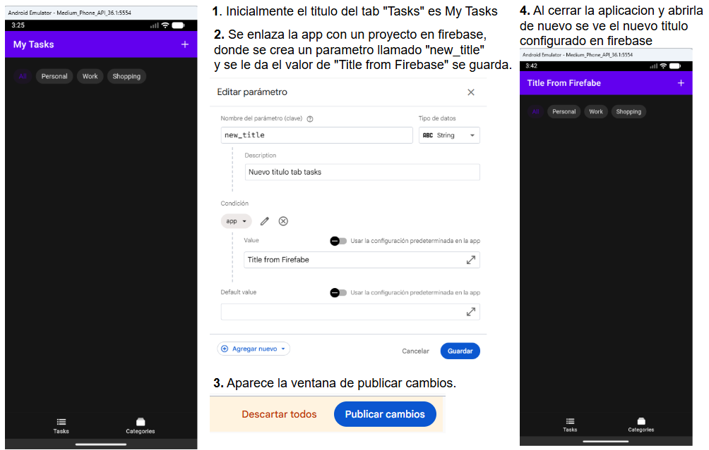

# To-Do List App (Ionic + Angular Standalone)

This application is a modern to-do list with category management, built using Ionic and Angular Standalone components.

## Features
- Add, complete, and delete tasks.
- Categorize tasks with custom colors.
- Filter tasks by category.
- Local storage persistence.
- Premium dark mode UI.

## Prerequisites
- **Node.js**: v18 or later.
- **Ionic CLI**: `npm install -g @ionic/cli`.
- **Java JDK**: JDK 17 or 21 (recommended).
- **Android SDK**: With Command Line Tools and Build Tools installed.
- **Gradle**: Installed and in your PATH.

## Getting Started

1. **Install dependencies**:
   ```bash
   npm install
   ```

2. **Run locally**:
   ```bash
   ionic serve
   ```


## APK Generated

[app-todo-debug.apk](https://github.com/wgir/accenture-todo-list/blob/main/app-todo-debug.apk)

## Compiling for Mobile (Cordova)

### Android
For a streamlined build process that avoids common CLI conflicts and automatically renames the output APKs, use the following commands:

#### 1. Generate Debug APK (For Testing)
```bash
npm run build:android
```
- **Output**: `app-todo-debug.apk` (in the project root)
- **Use case**: Quick testing on emulator or physical device.

#### 2. Generate Release APK (For Production)
```bash
npm run build:android-release
```
- **Output**: `app-todo-release.apk` (in the project root)
- **Use case**: Final version for testing. 
- *Note: This APK is **unsigned**. You will need to sign it with a Keystore before installing on a physical device.*

#### Manual Steps (If needed):
1. **Build the Web project**: `npm run build`
2. **Build the Android APK**: `ionic cordova build android --no-build`

### iOS
1. **Build the Web project**:
   ```bash
   npm run build
   ```

2. **Build the iOS app**:
   ```bash
   ionic cordova build ios --no-build
   ```

## Troubleshooting
If you encounter `Error: Unknown argument: platform`, it is because the Ionic script is trying to pass a flag to the new Angular builder that it doesn't recognize. Using the `--no-build` flag as shown above skips this step and uses the already compiled `www` folder.

## Firebase and Remote Config



## Optimization

1. **Lazy Loading**: Implemented lazy loading for feature modules to reduce initial bundle size.
2. **Tree Shaking**: Utilized tree shaking to remove unused code.
3. **Code Splitting**: Implemented code splitting to split the application into smaller chunks.
4. **Pagination**: Implemented pagination for task list to reduce memory usage and improve performance.
5. **Minification**: Implemented minification for CSS and JavaScript files to reduce file size.
6. **Gzip Compression**: Implemented gzip compression for API responses to reduce network transfer size.

## Challenge

The most big challenge was integrate Firebase and Remote Config to the app. I never used this before and I had to search for a lot of information to make it work. 

## Performance best practices

1. **Lazy Loading**: Applying lazy loading to the pages. This is implemented in your routing configuration using the modern Angular standalone component pattern.
2. **TrackBy in *ngFor***: Prevents full DOM re-creation.
3. **Mobile-Specific Best Practices**: Test on Android Real Devices (NOT only emulator)

## Code quality

1. **TypeScript**: Implemented TypeScript for type safety and better code quality.
2. **Angular Standalone Components**: Implemented Angular Standalone Components for better code quality.
3. **Angular Router**: Implemented Angular Router for better code quality and reduce the size of the bundle.
4. **Automated Linting and Standardization**: Implemented Automated Linting and Standardization for better code quality.
5. **Reactive State Management with RxJS**: Instead of manual state handling, I used RxJS BehaviorSubject and Observables in our services. Data Consistency: Using tasks$ observables ensures that any change in the data (adding, deleting, or toggling a task) is automatically reflected across all components listening to that data.
Async Pipe: I utilized the Angular async pipe in templates (where possible) to manage subscriptions automatically, preventing memory leaks.
